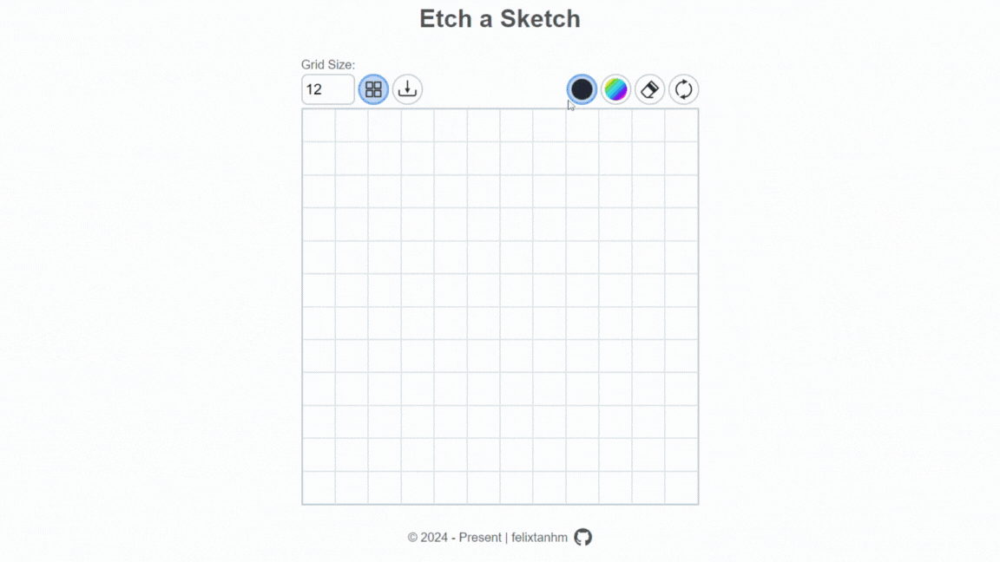

# Etch A Sketch 🎨

A tool for drawing pixel based art built with HTML, CSS and Javascript. This project covers basics of Javascript, including loops, arrays, functions and DOM manipulation.

[**Live Demo**](https://felixtanhm.github.io/my-odin-projects/foundations/04-etch-a-sketch/) ✨ |
[**Project Specs**](https://www.theodinproject.com/lessons/foundations-etch-a-sketch) 📝

## 🪃 Features

- Variable grid size.
- Color picker
- Rainbow filler
- Eraser filler
- Display Grid lines
- Export image as PNG
- Mobile responsive

#### 🧭 Future Implementations

## 💻 Built With

- HTML
- CSS
- Javascript

## 📌 Attributions

SVG Icons and app UI inspiration from [CJohnston079](https://github.com/CJohnston079)
