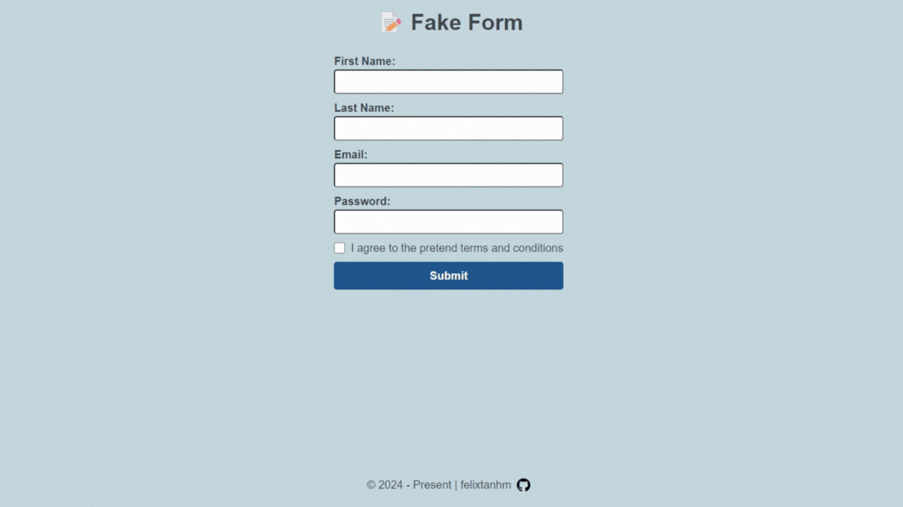

# Sign Up Form 📝

A simple sign up form to learn more about form validations and managing submissions. For aesthetical reasons, form methods have been excluded with `preventDefault` and the submission event is handled with javascript instead.

[**Live Demo**](https://felixtanhm.github.io/my-odin-projects/full-stack-javascript/01-sign-up-form/) ✨ |
[**Odin's Project Specs**](https://www.theodinproject.com/lessons/node-path-intermediate-html-and-css-sign-up-form) 📝

## 🪃 Features

- Basic Form Validation
- Form Submission
- Mobile responsive

#### 🧭 Future Implementations

- Add password strength indicator

## 💻 Built With

- HTML
- CSS
- Javascript
