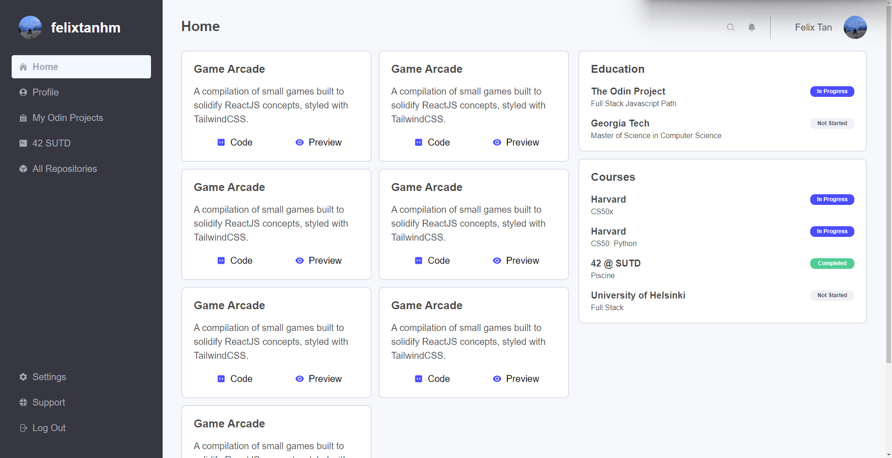

# Admin Dashboard 📊

An Admin Dashboard displaying my progress in learning how to code. This was built using mostly CSS Grid to familiarise using CSS Grid for styling.

[**Live Demo**](https://felixtanhm.github.io/my-odin-projects/full-stack-javascript/02-admin-dashboard/) ✨ |
[**Odin's Project Specs**](https://www.theodinproject.com/lessons/node-path-intermediate-html-and-css-admin-dashboard) 📝

## 🪃 Features

- Styling done mostly with CSS Grid

#### 🧭 Future Implementations

- Add finished portfolios
- Update education and courses

## 💻 Built With

- HTML
- CSS
- Javascript
