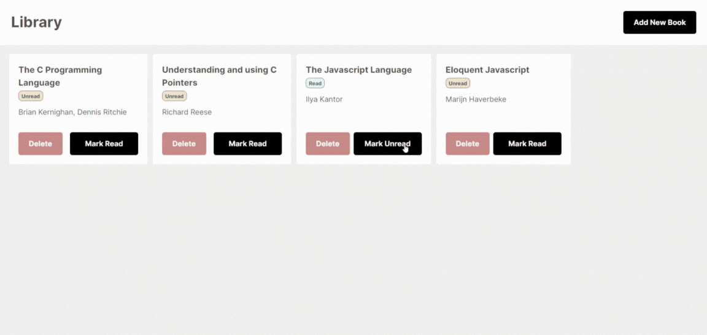

# Library 📚

A simple cataloging application to store saved objects. This project serves to familiarise using object constructors to add, modify and remove objects from a list.

[**Live Demo**]() ✨ |
[**Project Specs**](https://www.theodinproject.com/lessons/node-path-javascript-library) 📝

## 🪃 Features

- Add / Delete books from the library
- Modal implementation

#### 🧭 Future Implementations

- Local storage for data persistence
- Search bar

## 💻 Built With

- HTML
- CSS
- Javascript
